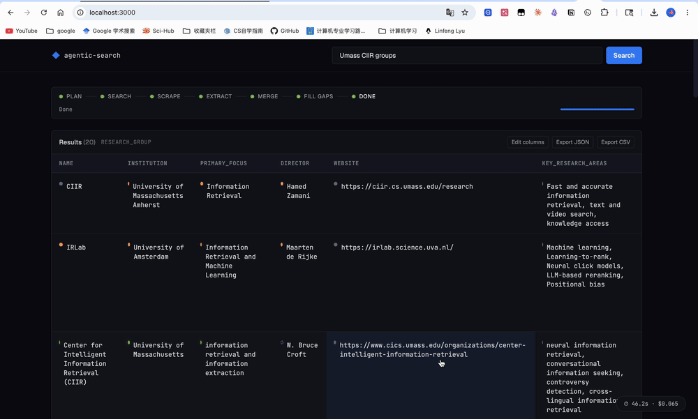

# Agentic Search

> Turn a topic query into a structured table of entities — every cell sourced and confidence-scored.

`agentic-search` is an end-to-end agent that plans, searches, scrapes, extracts, resolves, and fills gaps to produce a comparison table for any topic. It goes beyond the standard *search → extract* pipeline by being **agentic**: it infers its own schema, expands its own queries, deduplicates entities across sources, and autonomously fires follow-up searches to fill missing cells.



## Quick start

```bash
cp .env.example .env
# fill in ANTHROPIC_API_KEY and BRAVE_SEARCH_API_KEY
docker compose up --build
# frontend: http://localhost:3000
# backend:  http://localhost:8000
```

That's it. The first cold start builds the Playwright image (~1 min). Try one of the example chips on the landing page.

## How it works

```
┌──────────┐   ┌──────────┐   ┌──────────┐   ┌────────────┐   ┌─────────────┐   ┌─────────────┐
│  Planner │ → │ Searcher │ → │ Scraper  │ → │ Extractor  │ → │ Merge/Dedup │ → │ Gap Filler  │
│  (LLM)   │   │ (Brave)  │   │ (httpx + │   │ (LLM per-  │   │ (fuzzy + cell-│ │ (targeted   │
│ schema + │   │ + cache  │   │ trafil + │   │ chunk JSON)│   │ level merge)  │ │ search loop)│
│ queries  │   │          │   │ playwr.) │   │            │   │               │ │             │
└──────────┘   └──────────┘   └──────────┘   └────────────┘   └─────────────┘   └─────────────┘
                                                                                      │
                                                                                      ▼
                                                                              ┌─────────────┐
                                                                              │ Follow-ups  │
                                                                              │ + final SSE │
                                                                              └─────────────┘
```

1. **Planner** — Given `"AI startups in healthcare"`, the LLM infers `entity_type=company` and a schema (`name`, `founded`, `funding`, `focus_area`, ...) plus 4–6 diverse search queries.
2. **Searcher** — Issues queries against Brave Search (paced to respect the free-tier 1 req/sec), normalizes URLs, deduplicates, and enforces domain diversity (≤2 results/domain).
3. **Scraper** — `httpx` + `trafilatura` extracts main content. If content is thin (<200 chars) and `playwright` is available, it retries with a headless browser. Honors `robots.txt`. Negative results are cached so broken URLs aren't retried.
4. **Extractor (Pass 1)** — Each chunk is sent to Claude with the inferred schema. The model returns every entity it sees + the **exact quote** that supports each value. Chunks are processed concurrently (semaphore=5).
5. **Merger (Pass 2)** — Fuzzy entity resolution (`thefuzz.token_sort_ratio > 85`, suffix-stripped) collapses `"Tempus AI"`, `"Tempus"`, `"Tempus, Inc."` into one row. Per-column values are bucketed; conflicts are surfaced rather than silently dropped.
6. **Gap Filler** — Scans the merged table for empty cells in high-value rows, generates focused queries like `"Tempus AI" funding raised`, runs a mini search/scrape/extract loop, and merges in the new evidence. Gap-filled cells are tagged `UNVERIFIED` unless two sources agree.
7. **Follow-ups** — One final LLM call proposes related queries from the entity list.

Every result is streamed to the UI via SSE: status events for each stage, a partial result when initial extraction finishes, and the final result with cost + follow-ups.

## Key features (beyond the minimum)

| Feature | What it does |
|---|---|
| **Schema inference** | Columns are decided by the LLM per-query — no hardcoded templates. |
| **Multi-hop gap filling** | After the initial table, the agent identifies empty cells and runs new searches to fill them. |
| **Cell-level source attribution** | Every cell stores a list of `SourceReference`s with the exact quote snippet. Click any cell to inspect. |
| **Conflict detection** | When sources disagree, both values are kept — the winner is the most-supported, the rest are surfaced in the source panel. |
| **Confidence scoring** | Four levels: HIGH (≥2 distinct domains agree), MEDIUM (1 specific source), LOW (1 vague), UNVERIFIED (gap-filled / inferred). |
| **Streaming UI** | Server-Sent Events stream status, partial results, and final results — the user sees the table appear progressively. |
| **JS fallback scraping** | `trafilatura` first; on thin content, `playwright` renders the page. |
| **SQLite cache** | Scrape results (24h TTL) and search results (1h TTL) are persisted. Negative results cached too. |
| **Cost dashboard** | Live token counts, page counts, LLM call counts, estimated USD cost, wall-clock time. |
| **Schema editing** | Edit columns inline. `/api/search/refine` re-runs extraction against the cached scrapes — fast iteration. |
| **Follow-up suggestions** | LLM-generated next queries appear after every search. |

## Architecture & design decisions

### Why two-pass extraction
Single-pass extraction either misses entities split across pages or produces duplicates with conflicting attribute values. Splitting into (1) per-chunk extraction and (2) deterministic Python-side merging means:
- Each chunk gets full LLM attention on a single (URL, schema) combination.
- Merging is deterministic, debuggable, and free.
- Conflicts can be detected and preserved rather than hidden by stochastic LLM tiebreaking.

### Why fuzzy entity resolution (not LLM resolution)
The same company appears as `Tempus`, `Tempus AI`, `Tempus, Inc.`, `Tempus Labs`. Asking the LLM to resolve them across the full result set is expensive and non-deterministic. Suffix stripping + `token_sort_ratio ≥ 85` covers the vast majority of cases at zero LLM cost.

### Why cell-level confidence
Not all cells are equal. A company name found on three sites is more reliable than a funding number found in one blog post that might be out of date. Surfacing confidence as a colored dot lets the user prioritize verification. This directly mirrors nugget-based evaluation: each cell is its own atomic claim.

### Why a gap-filling loop
First-pass extraction realistically only fills 40–60% of cells. The agent loop closes the gap autonomously without asking the user to issue more searches. Capping the loop at 10 targeted queries keeps cost bounded.

### Why SQLite
The cache hit rate during iteration (refining schemas, re-running benchmarks) is what makes the dev loop tolerable. SQLite is portable, zero-config, async-compatible (`aiosqlite`), and adequate for this scale. Anything more would be premature.

### Why Brave Search
Free tier covers the demo budget (2k queries/month). Clean JSON. Reliable. No scraping-TOS gray area. The searcher is small enough that swapping in SerpAPI or Tavily is a 50-line change.

### Why Server-Sent Events (not WebSockets)
SSE is one-way (server → client) which is exactly what we need — there are no client→server messages mid-pipeline. SSE is simpler, debuggable with `curl -N`, and survives behind most proxies.

## Known limitations

- **JS-heavy SPAs**: Even Playwright can't extract from sites that aggressively lazy-load behind paywalls or scroll triggers.
- **Brave free-tier rate limits**: 1 req/sec, 2k queries/month. The searcher paces requests; the cache amortizes repeated queries.
- **Entity resolution edge cases**: Short or ambiguous names (e.g., `"Apple"` the company vs. `"apple"` the fruit) can collide. The schema's `entity_type` field reduces but doesn't eliminate this.
- **LLM non-determinism**: Re-running the same query may produce slightly different schemas/values. Set `temperature=0` everywhere but Claude's sampling is still stochastic.
- **No freshness guarantee**: Results are as fresh as the search index; for time-sensitive data, the user should add a year token to the query.
- **Gap-filling cost**: Each gap query costs ~$0.01–0.02 in LLM + 1 Brave call. Capped at 10 per run; tune `MAX_GAP_SEARCHES` if you need more.
- **No persistent results store**: Search results aren't persisted across pages; refreshing the browser starts over.

## Cost & latency (representative)

These numbers come from `backend/eval/benchmark.py` on a warm cache:

| Query | Entities | Latency | Cost |
|---|---|---|---|
| AI startups in healthcare | ~12 | 35–55s | $0.06–0.10 |
| top pizza places in Brooklyn | ~10 | 30–45s | $0.04–0.08 |
| open source database tools | ~14 | 40–60s | $0.07–0.11 |

Roughly: **planning $0.01 · extraction $0.04 · gap-filling $0.03 · follow-ups $0.005**. Re-runs (cache hits on search + scrape) drop to ~$0.04 and ~10s.

## Setup

### With Docker (recommended)

```bash
git clone <this-repo>
cd agentic-search
cp .env.example .env  # fill in your keys
docker compose up --build
```

Frontend at http://localhost:3000, backend at http://localhost:8000. The backend image bundles Playwright + Chromium.

### Without Docker

```bash
# Backend
cd backend
python -m venv .venv && source .venv/bin/activate
pip install -r requirements.txt
python -m playwright install chromium
export ANTHROPIC_API_KEY=... BRAVE_SEARCH_API_KEY=...
uvicorn main:app --reload --port 8000

# Frontend (new shell)
cd frontend
npm install
npm run dev  # http://localhost:5173 (proxies /api → :8000)
```

### Run the benchmark

```bash
cd backend
python -m eval.benchmark --limit 3
# results land in ../eval_results/
```

## API reference

| Method | Path | Body / Params | Returns |
|---|---|---|---|
| `GET` | `/api/search?q=...` | — | Server-Sent Events: `status`, `schema`, `partial`, `result`, `error` |
| `GET` | `/api/search/sync?q=...` | — | Full JSON result |
| `POST` | `/api/search/refine` | `{ query, columns, column_descriptions?, entity_type? }` | Full JSON result (reuses cached scrapes) |
| `GET` | `/api/health` | — | `{ "status": "ok" }` |

Example:

```bash
curl -N "http://localhost:8000/api/search?q=AI%20startups%20in%20healthcare"
```

## Repository layout

```
agentic-search/
├── README.md
├── .env.example
├── docker-compose.yml
├── backend/
│   ├── Dockerfile
│   ├── requirements.txt
│   ├── main.py                    # FastAPI app + SSE route
│   ├── config.py                  # Settings, env vars, constants
│   ├── agent/
│   │   ├── planner.py             # LLM schema inference + query expansion
│   │   ├── searcher.py            # Brave Search + dedupe + diversity
│   │   ├── scraper.py             # httpx + trafilatura + playwright fallback
│   │   ├── extractor.py           # Pass 1 (per-chunk) + Pass 2 (merge)
│   │   ├── gap_filler.py          # Targeted multi-hop search loop
│   │   └── pipeline.py            # Orchestrator + SSE generator
│   ├── models/schema.py           # Pydantic contracts
│   ├── prompts/templates.py       # All LLM prompts
│   ├── utils/
│   │   ├── cache.py               # SQLite cache (scrape + search)
│   │   ├── chunker.py             # Paragraph-aware chunking
│   │   ├── confidence.py          # Per-cell confidence scoring
│   │   ├── dedup.py               # Fuzzy entity clustering
│   │   └── llm.py                 # Anthropic client + cost tracker + JSON parser
│   └── eval/
│       ├── benchmark.py
│       └── test_queries.json
├── frontend/
│   ├── Dockerfile
│   ├── nginx.conf
│   ├── package.json
│   ├── vite.config.js
│   ├── tailwind.config.js
│   ├── index.html
│   └── src/
│       ├── App.jsx
│       ├── api.js                 # SSE client
│       ├── hooks/useSearch.js     # useReducer state machine
│       └── components/...         # SearchBar, StatusFeed, ResultsTable, SourcePanel, SchemaEditor, CostDashboard, QuerySuggestions
└── eval_results/                  # Benchmark outputs (checked in)
```

## License

MIT. Submitted for the Naget / CIIR agentic search challenge.
